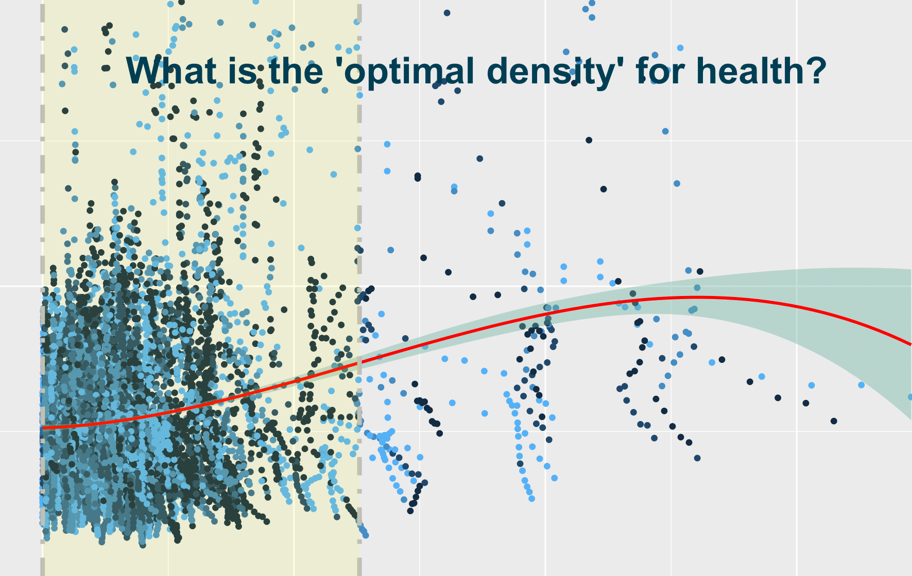

__

</a>
___

# Assessing trade-offs and optimal ranges of density for life expectancy and 12 causes of mortality in Metro Vancouver, Canada, 1990-2016

___ 

## Objective

Understanding and managing the impacts of population growth and densification are important steps for sustainable development. This study sought to evaluate the health trade-offs associated with increasing densification and to identify the optimal balance of neighbourhood densification for health.

## Collaboration

This study was a collaboration between the University of British Columbia and Pathways for Equitable Healthy Cities and funded by the Wellcome Trust.

## Data source

Census tract-level life expectancy and cause-specific mortality estimates were collected from UBC, which was derived using mortality data from <a href='https://www.popdata.bc.ca/data/listings'>BC Ministry of Health via PopDataBC</a>. Sociodemographic information, such as population and age, was collected from <a href='https://www12.statcan.gc.ca/census-recensement/index-eng.cfm'>Statistics Canada</a>. The Material and Social Deprivation Index (MSDI) scores were collected from the <a href='https://www.canue.ca/'>Canadian Urban Environmental Health Research Consortium</a>.

## Main Findings

At densities above ~9,400 persons per km2, LE began to decrease more rapidly.

By cause, densification was linked to decreased mortality for major causes of mortality in the region, such as cardiovascular diseases, neoplasms, and diabetes. 

Greater inequality with increasing density was observed for causes such as HIV/AIDS, sexually transmitted infections, and self-harm and interpersonal violence.

## Published Manuscript

The findings of this study was published in the journal, <a href='https://doi.org/10.1016/j.healthplace.2021.102692'>International Journal of Environmental Research and Public Health</a>. The following citation can be used:

Yu J, Gustafson P, Tran M, Brauer M. Assessing trade-offs and optimal ranges of density for life expectancy and 12 causes of mortality in Metro Vancouver, Canada, 1990-2016. Health & place. 2022 Mar 9;72:102692.

### Directory structure

The following folders include scripts that were used to process the data:

* `1-data:` data used for difference-in-difference models and cubic splines

* `2-optimal-density:` identifies optimal ranges using cubic splines and second order derivatives and plots these figures

* `3-difference-in-differences-models:` quasi-experimental design of density on multiple health outcomes by SES

<em>For more information, contact me at j.yu@ubc.ca.</em>
